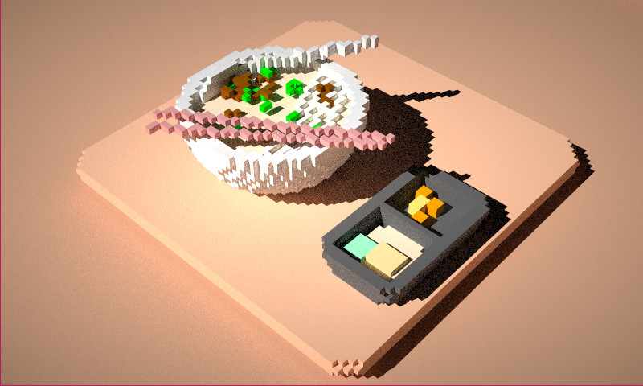

# <a name="title">Taichi Voxel Challenge</a>

<p align="center">
</img>
</p>


> This is a bowl of beaf rice noodle from my favorite, NoodleTalk

# Installation
I built Taichi from source in Windows. This means the following the steps on the [Developer Guide](https://docs.taichi.graphics/lang/articles/dev_install).

# Run
```
python main.py
```
